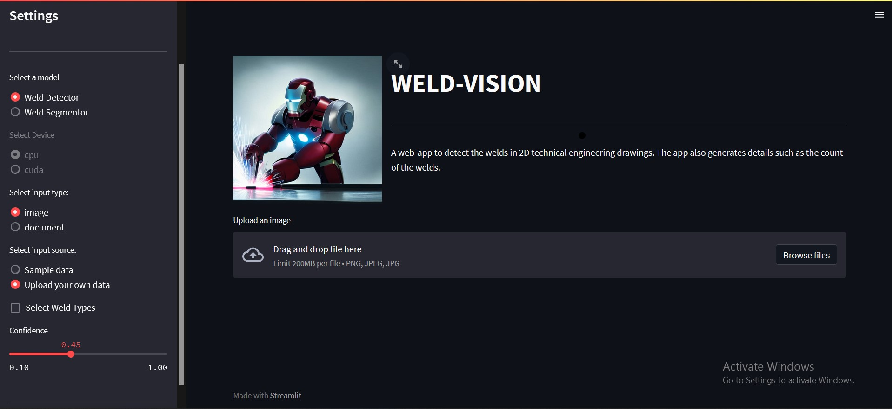

# Object Detection using Yolov8
A web interface for real-time yolo inference using streamlit. It supports CPU and GPU inference




## Features
- **Caches** the model for faster inference on both CPU and GPU.
- Supports two models: detection and segmentation
- Supports both CPU and GPU inference.
- Supports:
  - Custom Classes
  - Changing Confidence


## How to run
After cloning the repo:
1. Install requirements
   - `pip install -r requirements.txt`
2. Add sample images to `data/sample_images`
3. Add the model file to `models/` and change `cfg_model_path` to its path.
```bash
git clone https://github.com/moaaztaha/Yolo-Interface-using-Streamlit
cd Yolo-Interface-using-Streamlit
streamlit run app.py
```
